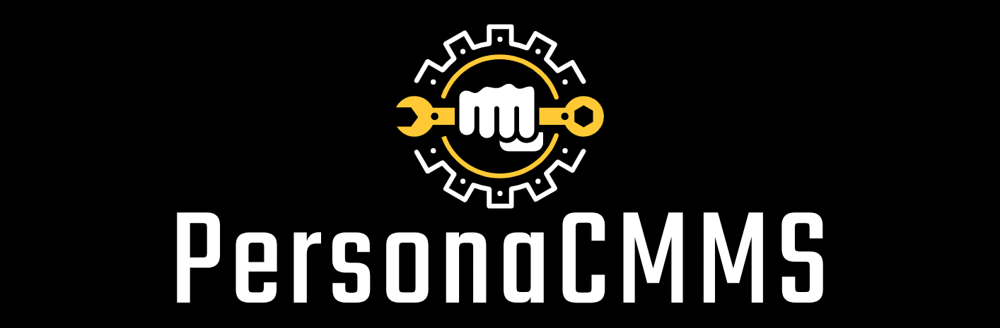

# PersonaCMMS - Personal Maintenance Management

# Motivation
As is common, I have accumulated items that require periodic and corrective maintenance: "Assets". These assets include my house, vehicles, generator, recreational vehicles, etc.

So I went searching for off the shelf solutions to maintain my maintenance history, remind me for new maintenance, and where I can take notes about the nuanced tools and materials I need for each task for each asset.  I tried a few but they were more geared toward enterprise applications and just were not the simple experience I desired for maintaining my personal assets.

PersonaCMMS is an application where you can enter your assets, enter their maintenance tasks, check back periodically for reminders, and maintain the maintenance history for each in one pace. The intent is to eliminate the cognitive load of maintaining your assets, and life.
# How To Navigate
This is a monorepo containing several different projects all related to this application inlcluding the restapi, sdk, and all interfaces (web, phone, cli) implemented on top of the sdk.
- [Projects](docs/projects.md)
- [Development](docs/developer.md)

