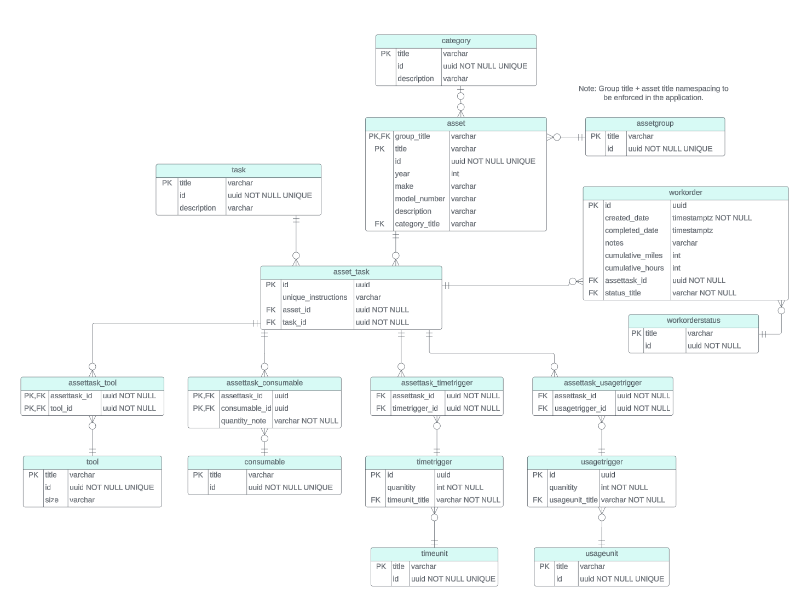

# PersonaCMMS REST API

## Description
A backend service hosting the core of the PersonaCMMS functionality.

## Technical Details
**Stack:**
* imperative code written in golang
* httpapi: golang + gin
* application: golang
* store: golang + PostgreSQL

**DB schema:**

## TODO
* move these TODOs into GitHub issues
* Implement proper error propagation up from store layer through app layer to httpapi layer
* Implement proper app layer error handling in the httpapi layer (correct http status codes, etc.)
* Implement integration testing for REST calls through all the layers
* Implement app layer task frequency scanning / work order creation
* create a dockerfile to containerize the app
* add consistent logging
    * log levels (Err, Warn, Info, Debug)
    * log service response times
    * trace requests through layers
* add integration with TODOist - can be used as an alternative UI (easier access less feature rich UI)
    * implement feature flag
    * implement monitoring for work order completion
    * implement api integration for creating TODOs 

* Future Features
    * Add asset tagging and filtering based on tag